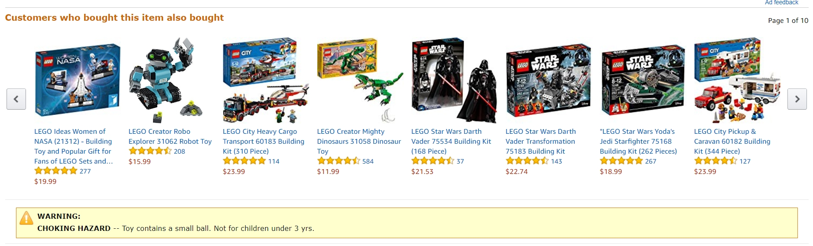
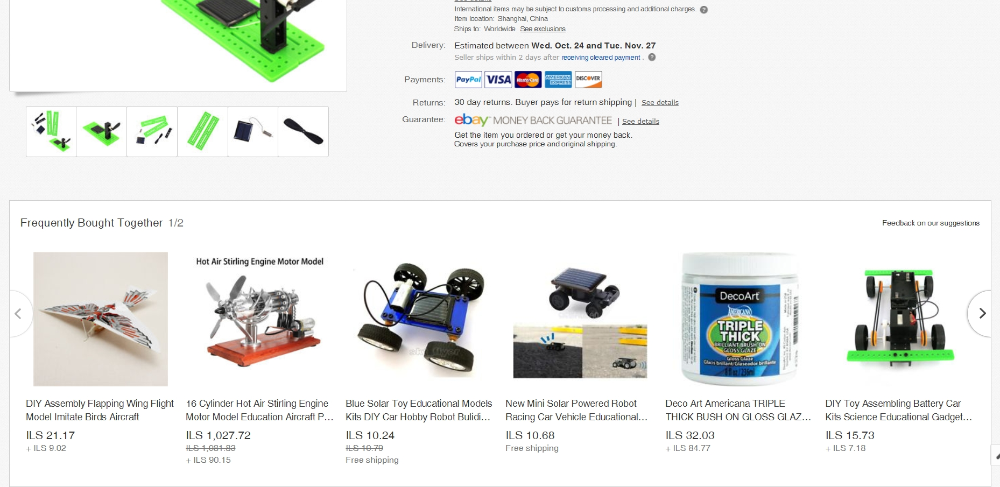
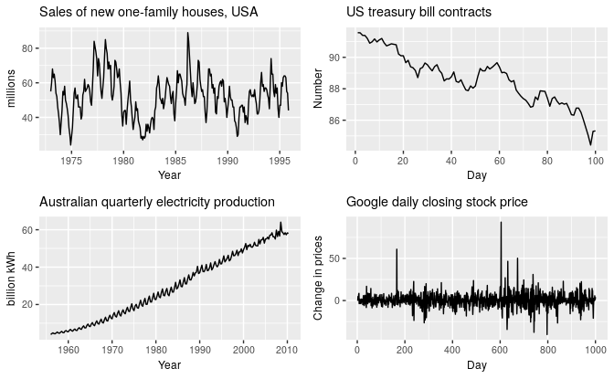

```{css, echo=FALSE}
p, h1, h2, h3, h4, ul, ol {
  direction: rtl;
}

img {
  direction: rtl;
  display: block;
  margin-left: auto;
  margin-right: auto;
}

```

מדעי הנתונים (או Data Science) כפי שנקרא המונח בשפה המקצועית, מערב תחומי מדע שונים, לדוגמה: מתמטיקה, סטטיסטיקה, מדעי המחשב, הנדסת תעשיה, ועוד.

התחום הפך למבוקש מאוד בשנים האחרונות, בעיקר לאור ההצטברות של מסות של נתונים, לדוגמה מפעולות אוטומטיות שקורות באופן שקוף למשתמש - כשאנחנו מדפדפים באפליקציה, מבצעים רכישה, או סתם מבקרים באתר החדשות המועדף עלינו.

כל פעולה שלנו מתועדת והופכת לנתונים, שמהם אפשר להפיק תובנות שיכולות לשמש כדי להניע אותנו, המשתמשים, לפעולה מסוימת (לדוגמה לרכישה של מוצרים, ביקור במסעדה מסוימת), או כדי לשפר וליצור תהליכים ומוצרים (לדוגמה: הנחיות ניווט עם מסלול מיטבי הביתה, או אפילו רכב אוטונומי שיקח אותנו לשם).

מדעי הנתונים היא קבוצה רחבה של כלים ושיטות שנועדו לתמוך אותנו בניתוח הנתונים, הפיכתם לתובנות, והטמעה של הכלים בסביבות עבודה (Production), המאפשרים קבלת החלטות בזמן אמת וללא התערבות אדם (Automation).

לצורך כך, נדרשים כלים ובעלי מקצוע שיכולים להפעיל את הכלים. הקורס הזה הוא קורס מעשי ולא תיאורתי, כלומר הוא דן בכלים עצמם ומניח שהידע התיאורתי קיים, ברמה מסוימת. הוא אינו קורס בסטטיסטיקה, והוא אינו שם דגש על התיאוריה הסטטיסטית או האלגוריתמית שמאחורי הפקודות אלא בעיקר על הטכניקה - איך לממש את התיאוריה באמצעות R.

לכן, הקורס יתאים במיוחד לאלו שיש להם רקע כלשהו בתחום רלוונטי, לדוגמה:

   * מדעי המחשב
   * מתמטיקה
   * סטטיסטיקה
   * הנדסת תעשייה
   * מומחי BI
   * אנליסטים
   * מי ששולט בשפה מסוימת למדעי הנתונים (לדוגמה Python), ומעוניין להכיר טוב יותר גם את R.
   * הקורס יכול להתאים גם למי שמעוניין בחשיפה ראשונית לתחום מדעי הנתונים - מנקודת מבט טכנית-תכנותית.

הקורס משלב את הטכניקה עם הרבה דוגמאות מהעולם העסקי והאקדמי. מי שמעוניין להשלים גם ידע תיאורתי רלוונטי, יכול להיעזר בספר המעולה הבא:

<p style="direction:ltr; text-align:left">The Elements of Statistical Learning: Data Mining, Inference, and Prediction, Second Edition, by T. Hastie, J, Friedmand, and R. Tibshirani. <em>Springer</em>, 2009. Available online (as free ebook), here: <a href="https://web.stanford.edu/~hastie/Papers/ESLII.pdf">https://web.stanford.edu/~hastie/Papers/ESLII.pdf</a>, (feched 02/10/2018).</p>


ספר מצויין נוסף (ובהרבה מובנים תוכנו מתלכד עם תוכן הקורס) הוא הספר הבא:

<p style="direction:ltr; text-align:left">R for Data Science, by G. Grolemund, and H. Wickham, <em>O'reilly</em> (2017). Available online: <a href="https://r4ds.had.co.nz/">https://r4ds.had.co.nz/</a>, (feched 26/07/2018).</p>

הקורס נוגע בנושאים מגוונים: 

   * החל מאיך נראה "יומו של מדען הנתונים" והמיומנויות הנדרשות והמצופות ממדען נתונים, דרך דוגמאות לשימושים שונים של מדעי הנתונים. 
   * פרק "התקנות" שמסביר איך להתקין את הכלים הנדרשים. 
   * פרק על `tidyverse` - קבוצת חבילות ופקודות שנועדו להכנת נתונים ותמרון מבני נתונים. 
   * קריאת (יבוא) נתונים ממקורות חיצוניים.
   * כלי הצגת נתונים (`ggplot2`). 
   * מידול של נתונים הכולל: רגרסיה לינארית, רגרסיות מוכללות, בחירת משתנים (Variable selection), וצמצום מימדים (Dimension reduction).
   * סיווג (Classification) של תצפיות, באמצעות עצי החלטה (Classification and regression trees), יערות אקראיים (Random forests), אלגוריתמי שכנות (k-NN), ומכונות וקטור תומך (Support vector machines).
   * קטלוג (Clustering), באמצעות `kmeans`.
   * כלים להעמקה: שימוש ב-Cheatsheets, תחרויות (kaggle), ומקורות נוספים.
   * רקע ראשוני בנושאים מתקדמים כגון: בניית אפליקציות רשת באמצעות חבילת `shiny`, תיעוד באמצעות `rmarkdown`, אוטומציה של קריאת נתונים מהרשת (Scraping), והתממשקות ל-Web APIs, הקמת שרת R בענן.
   
   
אגב, הקורס עצמו כתוב ב-R כולו (חבילת RMarkdown).


```{r setup, include=FALSE}
knitr::opts_chunk$set(echo = TRUE)
```

## יומו של "מדען הנתונים"

מה מתאים יותר מלהתחיל קורס כזה עם תרשים שמתאר איך מדען נתונים מבלה את יום העבודה שלו, קרי, מהן הפעולות שמבצע מדען הנתונים?

מדען נתונים למעשה עוסק במספר תחומים:

   * יבוא נתונים
   * סידור והכנת הנתונים
   * מחקר
      * המרה של הנתונים (טרנספורמציה)
      * ויז'ואליזציה של הנתונים (בתרשימים)
      * מידול של הנתונים
   * הפקת תובנות והעברתם הלאה


### כמה זמן לוקחת כל משימה?

הנתונים הבאים לקוחים מתוך סקר של אתר [kaggle](https://www.kaggle.com), אתר שבו מתפרסמות תחרויות בתחום מדעי הנתונים.

האתר ערך סקר בין קהילת הרשומים שבו. ישנה הטיה מסוימת מעצם ההסתכלות רק על קהילת הרשומים באתר, אבל התוצאות עדיין מעניינות והן מכילות אלפי תגובות.

את הנתונים הגולמיים אפשר להוריד בכתובת:
[https://www.kaggle.com/kaggle/kaggle-survey-2017](https://www.kaggle.com/kaggle/kaggle-survey-2017)

ראשית נטען את הסכמה (Scheme) שמתארת את מבנה הנתונים. אנחנו מציגים פה רק את המשתנים שנשתמש בהם כרגע:

```{r kaggle-scheme, warning=FALSE, message=FALSE, fig.width=10}
# data source:
# Kaggle MK and Data Science Survey, 2017.

# Pre-run this code to have the packages loaded:
library(tidyverse)

# This is just the data scheme ("codebook")
kaggle_scheme <- read_csv("01-data/kaggle-survey-2017/schema.csv")

# We are going to need the following fields:
kaggle_scheme[c(221:226, 87), 1:2] %>%
  knitr::kable(format = "pandoc")
```

עכשיו, נראה איך נראים הנתונים עצמם, המבנה עצמו הוא מבנה "טבלאי":

```{r kaggle-data, warning=FALSE, message=FALSE, fig.width=10}
# Now to load the actual data:
kaggle_survey17 <- read_csv("01-data/kaggle-survey-2017/multipleChoiceResponses.csv")
time_spent <- kaggle_survey17 %>%
  select(one_of(kaggle_scheme$Column[221:226]), Tenure)
time_spent_gathered <- time_spent %>%
  gather(activity, percent, -Tenure) %>%
  filter(percent >=0 & percent <= 100)

# Here's what the data looks like originally
time_spent
```

יש גם לא מעט תצפיות:

```{r, warning=FALSE, message=FALSE, fig.width=10}
# We actually have just 7500 observations because there are a lot of NAs
sum(!is.na(time_spent$TimeGatheringData))

# Here's what the data looks like after some munging
time_spent_gathered

# So now, lets plot the distribution, per item:
ggplot(time_spent_gathered, aes(x = 
                                  factor(activity, # set the x
                                           levels = kaggle_scheme$Column[221:226]), # levels to set order
                                y = percent)) + # set the y
  geom_boxplot(fill = "lightblue") + # tell ggplot we want a "boxplot" figure, and with lightblue color
  ylab("Percent [%]") +  # the caption for y-axis
  xlab("Activity type") +  # the caption for x-axis
  coord_cartesian(y = c(0, 100)) + # trim the y axis to avoid some errors (the data set has errors)
  theme(axis.text.x = element_text(angle = 15, size = 14)) # adjust the angle for x-ticks

```

התרשים הראשון נקרא boxplot, והוא דרך טובה לראות בבת אחת את התפלגות הנתונים. הקו באמצע כל מלבן מציג את החציון, נקודות מציגות ערכי קיצון, והמלבן עצמו תוחם את שני שליש ההתפלגות (רבעון ראשון עד שלישי).

***

**נקודה למחשבה**

לפני שאתם מתקדמים, נסו להבין את התרשים, ולענות על השאלות הבאות:

   1. איזו משימה שואבת הכי הרבה זמן?
   2. איזו משימה שואבת הכי פחות זמן?
   3. איפה יש הכי הרבה שונות בין מדענים שונים?
   4. למה לדעתכם זה ככה?

***

את אותם הנתונים אפשר לסדר בדרך קצת שונה, בתרשים ששמו barplot

```{r barplot of time spent proportions on activities}
ggplot(time_spent_gathered %>% 
         filter(percent <= 100) %>%
         group_by(activity) %>% 
         summarize(mean_percent = mean(percent, na.rm = TRUE)), 
       aes(x = factor(activity,
                      levels = kaggle_scheme$Column[221:226]), 
           y = mean_percent,
           label = paste0(round(mean_percent, 0), "%"))) + 
  geom_col(fill = "lightblue", color = "black") + 
  ylab("Average percent [%]") + 
  xlab("Activity type") + 
  geom_label()

```


ה-barplot מציג את הנתח היחסי של כל פעילות, בממוצע. מן הסתם סכום האחוזים אינו מגיע ל-100% משום שמדובר בממוצע על פני אחוזים.

התרשימים מלמדים אותנו שחלק מאוד גדול מעבודתו של מדען הנתונים היא סביב איסוף הנתונים וסידור שלהם (בממוצע 36%), לאחר מכן בניית מודלים (21%), הצגת נתונים וחילוץ תובנות (13%, 14%), ולבסוף, שילוב אלגוריתמים בסביבות תוכנה (11%).

מעניין גם לענות על השאלה, האם יש קשר בין וותק במקצוע לבין הפעילויות המבוצעות.

```{r tenure tasks, warning=FALSE, message=FALSE, fig.width=10}

# average percent as a function of tenure
time_spent_tenure <- time_spent_gathered %>%
  group_by(Tenure, activity) %>%
  filter(percent >=0 & percent <= 100) %>%
  summarize(mean_prc = mean(percent)) %>%
  filter(!is.na(Tenure))

ggplot(time_spent_tenure, aes(x = 
                                factor(activity, # set the x
                                           levels = kaggle_scheme$Column[221:226]),
                              y = mean_prc)) + 
  geom_bar(aes(fill = factor(Tenure, levels = c("I don't write code to analyze data",
                                                "Less than a year",
                                                "1 to 2 years",
                                                "3 to 5 years",
                                                "6 to 10 years",
                                                "More than 10 years"))),
           stat = "identity", position = "dodge", color = "black") + 
  ylab("Percent [%]") + 
  xlab("Activity type") +
  coord_cartesian(y = c(0, 100)) + 
  scale_fill_brewer(type = "seq", palette = 2) + 
  theme(axis.text.x = element_text(angle = 15, size = 14)) + # adjust the angle for x-ticks
  guides(fill = guide_legend("Tenure"))

```

השתמשנו במשחק הזה עם נתונים, כדי להראות כמה מידע אפשר לחלץ מסקר קצר עם 7 משתנים בסה"כ. כעת נציג כמה דוגמאות נוספות לשימוש במודלים של מדע הנתונים.

## מוטיבציה - דוגמאות ושימושים

### בעיות המלצה (recommender systems)

דוגמה של Amazon, ebay, netflix
מערכות המלצה משמשות כדי לשפר מצד אחד את השירות שניתן ללקוחות ומצד שני, לגרום להם לבצע יותר רכישות על ידי הצגת מוצרים רלוונטיים.



### סדרות עיתיות וחיזוי (time series forecasting)

דוגמה של מלאים
כדי לתכנן מלאי לוגיסטי, צריך קודם כל להעריך את היקף הביקוש (הצריכה). על ידי התאמת מודלים סטטיסטיים של חיזוי ניתן להעריך את היקף הביקוש לחודשים או שנים קדימה, תוך זיהוי מגמות, עונתיות, ותופעות ברות חיזוי אחרות.


הדוגמאות מכילות תבניות שונות. מחירי הדירות (שמאל למעלה) מראים מחזוריות של מספר ימים ועונתיות שנתית. חוזים עתידיים של ממשלת ארהב מראים טרנד יורד, וייצור חשמל באוסטרליה (ימין למטה) מצביע על טרנד עולה ועל עונתיות שנתית.
מחירי המניות אינם מציגים תבנית מסוימת אלא נראים כאקראיים לגמרי (ימין למטה).

דוגמאות אלו אומצו מהספר:

<p style="direction:ltr; text-align:left">Rob J. Hyndman and George Athansasopoulos, Forecasting: Principles and Practice 2nd edition, <em>OTexts</em>, 2018. Available Online <a href="">https://otexts.org/fpp2/</a> (fetched Sep 2018)</p>

### הסתברות לרכישה וחיזוי נטישה (estimating conversion probability and churn)

קובץ דוגמה שנעבוד איתו במהלך הקורס, של נתוני שירות הלקוחות של חברת Telco.
הקובץ ועוד רבים זמין באתר של IBM [בקישור](https://www.ibm.com/communities/analytics/watson-analytics-blog/guide-to-sample-datasets/)

### רפואה (Healthcare)

תוחלת החיים עם סרטן המעי הגס [קישור](https://colorectalcancermortalityprediction.shinyapps.io/CRCShiny/)

### דשבורדים (Shinydashboards)

דשבורד שכולו בנוי ב-R [לדוגמה](https://sarid.shinyapps.io/Sarid-Sample-Report/)

***

### תרגיל

1. תנו דוגמה לבעיה תחום העיסוק שלכם בעבודה, שעשויה להיפתר באמצעות כלים של Data Science (חיזוי או למידה סטטיטסית)

***


## התקנות

להתחלת הקורס מומולץ להתקין את הגרסאות האחרונות של [R](https://cran.r-project.org/) ו-[RStudio](https://www.rstudio.com/).

סביבת הפיתוח RStudio היא IDE (integrated development environment) פופלרי ונוח לכתיבת קוד R, ומומלץ לתרגל עליה מהרגע הראשון. היא חינמית (רישיון AGPL v3).

מבט ראשון תוכלו לראות שהסביבה מראה במקביל חלון לכתיבת סקריפטים, קונסול, את המשתנים שכרגע נמצאים בסביבת העבודה, וחלון שמציג גרפים, תיקיית העבודה, ועזרה על פונקציות.


לאחר ההתקנה, התקינו את חבילות ה-`tidyverse`. חבילות אלו הינן תוספות המביאות יכולות רבות ל-R, ועל חלקן נלמד בהמשך. בינתיים כדי להתקין אותן פשוט הקישו בקונסול ב-RStudio את הקוד הבא:

```
install.packages("tidyverse")
```

## הפרק הבא

השיעור הבא יעסוק בויז'ואליזציה, ולמה?

   1. זה כיף ומעניין.
   2. זה חלק מאוד משמעותי מהאפקטיביות של מחקר - ויז'ואליזציה עוזרת לנו למצוא תובנות, לקדם את המחקר ולשדר אותו הלאה.
   3. זה מאפשר לנו לצלול לתרגול כבר עכשיו, כיאה לקורס מעשי.
   4. זה ייתן לכם מוטיבציה להמשך.
   
