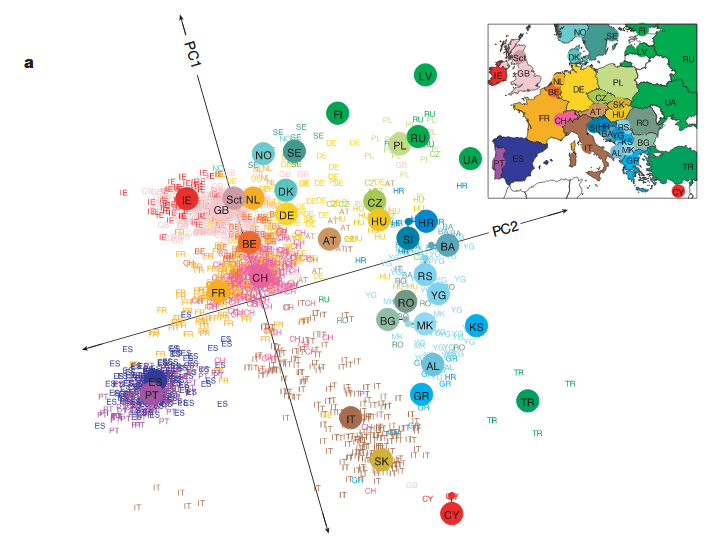
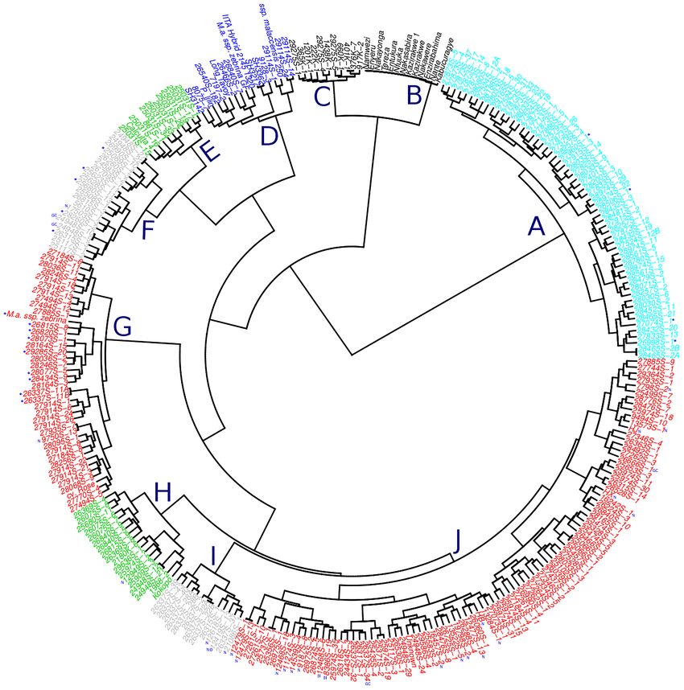

```{css, echo=FALSE}
p, h1, h2, h3, h4, ul, ol {
  direction: rtl;
}
```

עד כה בקורס עסקנו בקשר שבין משתנים מסבירים ($X_1,\ldots,X_p$) לבין משתנה תלוי $y$, ואיך מייצרים מודלים שונים שמתארים את הקשר שביניהם (בין אם מודלי רגרסיה, או מודלים מתקדמים יותר).

לעיתים הבעיה הניצבת בפנינו כחוקרים היא לא לתאר קשר בין משתנה תלוי למשתנים בלתי תלויים, אלא ללמוד על מבני הנתונים מתוך משתנים בלתי תלויים. לדוגמה:

   * אילו קבוצות קיימות? כיצד ניתן לקבץ תצפיות שונות יחדיו? איזו תצפית דומה לאחרות?
   * מה הקשר בין משתנים שונים? אילו משתנים הם מיותרים בתיאור מבנה הנתונים ואילו הכרחיים?

בגנטיקה של אוכלוסיות לדוגמה, עוסקים בדיוק בבעיות כאלו: כיצד לסווג מינים שונים או כיצד להבין ממחקר גנטי על הקשר ההיסטורי שבין אוכלוסיות שונות. במקרה הבא, הגדרה של שני משתנים בלבד (PC1, PC2) מצליחה להפריד חלק מהאוכלוסיות באופן טוב, שדי מזכיר את מפת אירופה.

[https://stats.stackexchange.com/questions/8777/in-genome-wide-association-studies-what-are-principal-components](https://stats.stackexchange.com/questions/8777/in-genome-wide-association-studies-what-are-principal-components)

המפה מתארת איך ממגוון משתנים המתארים שינויים גנטיים, ניתן לחלץ שני משתנים בלבד המסבירים את מירב השונות בין אנשים שונים, ואת הדימיון הרב המתקבל בין משתנים אלו לבין מפת הפיזור של האנשים באירופה.

המינים הבאים סווגו לפי מידת הקרבה שלהן אחד לשני, בתרשים שנקרא Dendrogram. התרשים מסודר כעץ שבו ענפים כאשר ענפים סמוכים הם תצפיות שיש ביניהן דמיון.

[https://www.researchgate.net/figure/Dendrogram-showing-the-genetic-diversity-of-the-genomic-selection-training-population_fig2_317632929](https://www.researchgate.net/figure/Dendrogram-showing-the-genetic-diversity-of-the-genomic-selection-training-population_fig2_317632929)

סוג הניתוחים הללו רלוונטי למקרים בהם אנחנו מנסים לפענח כיצד פרטים שונים מתקבצים יחדיו באוכלוסיה (Clustering) או כיצד משתנים שונים "מתנהגים" בהשוואה אחד לשני (Principle Component Analysis). 

שימו לב שיש הבדל מהותי בין יצירת אשכולות - המתייחס לפרטים שונים באוכלוסיה (תצפיות) לבין ניתוח גורמים (המתייחס למשתנים עצמם).

הרבה פעמים נשתמש בכלים אלו של unsupervised learning, כשלב ביניים לפני שנעבור למידול supervised.

נדון ראשית בניתוח גורמים (Principle Component Analysis - PCA).

## ניתוח גורמים / Principle Component Analysis

בניתוח מסוג PCA, אנחנו משתמשים בכלים של אלגברה לינארית כדי לסובב ולהזיז את מערכת הצירים של הנתונים. הזזה זו מתבצעת באופן כזה, שבו מערכת הצירים החדשה היא מערכת צירים שבה הציר הראשון הוא בעל השונות הגבוהה ביותר, הציר השני בעל שונות פחות גבוהה וכן הלאה (הכוונה לפיזור הנתונים בכל ציר חדש).

אם אנחנו בוחרים תת-קבוצה של צירים אלו, המשמעות היא שאנחנו בוחרים תת-קבוצה שמסבירה "X% מהשונות שיש בנתונים".

```{r iris pca example, messages=FALSE, warning=FALSE, fig.width=5, fig.height=3}
library(tidyverse)

# lets try to reduce the dimension of the iris dataset
ggplot(iris, aes(Sepal.Length, Sepal.Width, color = Species)) + geom_point()
ggplot(iris, aes(Sepal.Length, Petal.Length, color = Species)) + geom_point()
ggplot(iris, aes(Sepal.Length, Petal.Width, color = Species)) + geom_point()
ggplot(iris, aes(Sepal.Width, Petal.Width, color = Species)) + geom_point()
ggplot(iris, aes(Sepal.Width, Petal.Length, color = Species)) + geom_point()
ggplot(iris, aes(Petal.Length, Petal.Width, color = Species)) + geom_point()

# It looks like every two axis have their interaction (or not)
# Some are very correlated, for example the Petal.Width and Petal.Length seem to have a very strong linear relationship.
# To a lesser extent, the same can be said for Petal.Length<->Sepal.Length, and Petal.Width<->Sepal.Length

# Now, lets run the PCA
iris_pca <- prcomp(iris %>% select(-Species))
iris_pca

```

הפקודה מדווחת לנו על ארבעה רכיבים (תמיד מספר הרכיבים יהיה כמספר המשתנים הכללי שהכנסנו, במקרה זה ארבע משתנים).

כל משתנה מקבל "מקדם" שהוא המקדם שבו צריך להכפיל את המשתנה בשביל לקבל את ערך הרכיב החדש, הסכום שלהם הוא הרכיב החדש. לפעמים ניתן לתת פרשנות לרכיב החדש (כמעין ממוצע משוקלל), ולפעמים לא. הרבה פעמים התוצר של PCA הוא פשוט "קופסה שחורה".

כאשר משתמשים בפקודת `summary` על אובייקט PCA, מקבלים את השונות של כל משתנה חדש, ואת שיעור השונות המוסברת (שלו והמצטברת).

```{r pca summary}
summary(iris_pca)

# the following matrix contains the variables after they were rotated by the PCA
head(iris_pca$x)

# to rotate new data, just use the standard predict form
predict(object = iris_pca, newdata = iris %>% slice(1:5))
# `slice` selects the rows 1:5
ggplot(as_tibble(iris_pca$x) %>%
         mutate(Species = iris$Species), aes(x = PC1, y = PC2, color = Species)) + 
  geom_point() + 
  coord_equal() + 
  ggtitle("The first two components of PCA on the iris dataset")

```

שימו לב לטווחים של ציר ה-PC1 לעומת הטווחים של ציר ה-PC2.

לעיתים, שלב ה-PCA מהווה שלב מקדים בשביל לבנות רגרסיה,  והמשתנים המסבירים ברגרסיה הופכים להיות חלק מה-PCs.


***

### תרגיל PCA

   1. קראו את נתוני המטופלים (קובץ נטישת מטופלים), ובצעו PCA על כל המשתנים שהם משתני 0-1 (לא כולל משתנה הנטישה).
   2. כמה משתנים צריך בשביל להסביר 80% מהשונות שבנתונים? (כמה רכיבי PC).
   3. בצעו PCA שוב, והפעם כללו גם את משתנה הגיל. מה ההשפעה של הוספת המשתנה לתוצאת ה-PCA?
   4. לפקודת PCA ישנם שני פרמטרים: scale. ו-center. פרמטרים אלו "מכינים" את הנתונים לפני ביצוע ה-PCA על ידי מרכוז ונרמול. הריצו שוב את פקודת ה-PCA כולל שימוש במרכוז ונרמול של המשתנים. האם קיבלתם תוצאה שונה? כיצד אתם מסבירים זאת?
   5. בנו מודל רגרסיה לוגיסטית המבוסס על הרכיבים החדשים, וחוזה את אי-ההגעה לפגישה. השוו בין מודל זה, לבין המודל המקורי (ללא PCA). מהם ביצוע המודל המבוסס על PCA לעומת המודל ללא PCA?

באפשרותכם להיעזר בקוד הבא:

```
appointments <- read_csv("data-files/Medical_Appointments_No_Shows_KaggleV2-May-2016.csv") %>%
  mutate(no_show = `No-show` == "Yes")

appointments_pca_all <- prcomp(appointments %>% 
                                 select(XXX),
                               XXX = XXX, XXX = XXX)
summary(appointments_pca_all)

# Add the results of PCA as new variables into a dataset
appointments_dataset_pca <- appointments %>% 
  bind_cols(as_tibble(appointments_pca_all$x))

# Try various options of # of PCs. When can you say that a smaller number of variables achieves similar results to using the full 7 variables?
appointments_pcaX_glm <- glm(formula = 
                            no_show ~ PC1 + PC2 + ... + PCX,
                          family = binomial,
                          data = appointments_dataset_pca %>% filter(is_train))

# To examine performance you can either look at the residuals or visualize using an ROC...

```


```{r pca exercise, include = FALSE}

# Read the data
appointments <- read_csv("data-files/Medical_Appointments_No_Shows_KaggleV2-May-2016.csv") %>%
  mutate(no_show = `No-show` == "Yes") # change the Yes/No into True/False (which is like having 1-0)
# split to train and test set
appointments <- appointments %>%
  mutate(is_train = runif(NROW(appointments)) <= 0.8)
# build the logistic regression model
appointments_model <- glm(formula = 
                            no_show ~ Age + Scholarship + Hipertension + Diabetes +
                            Alcoholism + Handcap + SMS_received,
                          family = binomial,
                          data = appointments %>% filter(is_train))

# Now with PCA
appointments_pca <- prcomp(appointments %>% select(Scholarship, Hipertension, Diabetes, Alcoholism,
                                                   Handcap, SMS_received),
                           scale. = TRUE, center = TRUE)
summary(appointments_pca)

# PCA which includes age
# WRONG (no scaling no centering)
appointments_pca_wrong <- prcomp(appointments %>% 
                                 select(Scholarship, Hipertension, Diabetes, Alcoholism,
                                        Handcap, SMS_received, Age),
                               scale. = FALSE, center = FALSE)
appointments_pca_wrong$rotation
summary(appointments_pca_wrong)

# RIGHT (with scaling and centering)
appointments_pca_all <- prcomp(appointments %>% 
                                 select(Scholarship, Hipertension, Diabetes, Alcoholism,
                                        Handcap, SMS_received, Age),
                               scale. = TRUE, center = TRUE)
summary(appointments_pca_all)
appointments_pca_all$rotation

# now, adding the logistic regression based on 5 PCs
appointments_dataset_pca <- appointments %>% 
  bind_cols(as_tibble(appointments_pca_all$x))

appointments_pca5_glm <- glm(formula = 
                            no_show ~ PC1 + PC2 + PC3 + PC4 + PC5,
                          family = binomial,
                          data = appointments_dataset_pca %>% filter(is_train))
appointments_pca2_glm <- glm(formula = 
                            no_show ~ PC1 + PC2,
                          family = binomial,
                          data = appointments_dataset_pca %>% filter(is_train))

final_predictions <- appointments %>%
  mutate(nominal_model_pred = predict(appointments_model, 
                                      newdata = appointments, 
                                      type = "response"),
         pca5_model_pred = predict(appointments_pca5_glm, 
                                  newdata = appointments_dataset_pca, 
                                  type = "response"),
         pca2_model_pred = predict(appointments_pca2_glm, 
                                  newdata = appointments_dataset_pca, 
                                  type = "response"))

pca_model_roc <- final_predictions %>%
  filter(!is_train) %>%
  arrange(desc(pca5_model_pred)) %>%
  mutate(tpr=cumsum(no_show)/sum(no_show),
         fpr=cumsum(!no_show)/sum(!no_show)) %>%
  mutate(model = "glm based on PCA5") %>%
  bind_rows(
    final_predictions %>%
    filter(!is_train) %>%
    arrange(desc(nominal_model_pred)) %>%
    mutate(tpr=cumsum(no_show)/sum(no_show),
           fpr=cumsum(!no_show)/sum(!no_show)) %>%
    mutate(model = "glm without PCA")
  ) %>%
  bind_rows(
    final_predictions %>%
    filter(!is_train) %>%
    arrange(desc(pca2_model_pred)) %>%
    mutate(tpr=cumsum(no_show)/sum(no_show),
           fpr=cumsum(!no_show)/sum(!no_show)) %>%
    mutate(model = "glm based on PCA2")
  )

# An ROC illustrating the differences
ggplot(pca_model_roc, aes(x = fpr, y = tpr, color = model)) + 
  geom_line() + 
  geom_abline(intercept = 0, slope = 1) + 
  ggtitle("An ROC illustrating the influence of combining PCA with logistic regression.",
          subtitle = "Three options shown: original (7 variables), 2 PCs, and 5 PCs")


```

***

עד כה עסקנו בטיפול במשתנים, כעת נעסוק בטיפול בתצפיות באמצעות חלוקה לאשכולות (clustering).

## חלוקה לאשכולות (KMeans clustering, Hierarchical clustering)

### KMeans clustering

פקודת `kmeans` מחלקת את הנקודות במרחב לפי המרחק אחת מהשניה. במובן זה היא מזכירה את `knn` (שגם משתמשת במרחק בין נקודות), אך היא אינה נותנת תחזית או מתייחסת למשתנה תלוי כלשהו.

איך עובדת KMeans?

השיטה מנסה למצוא קבוצות אשר השונות בתוכן היא מינימלית (התצפיות בכל קבוצה דומות זו לזו), והשונות בין הקבוצות גבוהה (הקבוצות נמצאות רחוק אחת מהשניה).

נוסחה מקובלת לKMeans עושה שימוש במרחק אוקלידי בין הנקודות בכל קבוצה:

\[
W(C_k)=\frac{1}{|C_k|}\sum_{i,i'\in C_k}\sum_{j=1}^p(x_{ij}-x_{i'j})^2
\]

כאשר $C_k$ הוא מספר התצפיות בקבוצה $k$. נוסחה זו מייצגת את השונות בתוך אשכול $k$.

פונקציית המטרה שלנו תהיה למצוא חלוקה לאשכולות $C_1,\ldots,C_K$ כך שתקטין את סך השונות:

\[
\min_{C_1,\ldots,C_k}\sum_{k=1}^K{W(C_k)}
\]

מי קובע את $K$? אתם. 

איך? שאלה טובה.

לפעמים זה ניסוי וטעיה, לפעמים זה נגזר מדרישות או מטרות העבודה.

איך עובד האלגוריתם למציאת החלוקה $C_1,\ldots, C_k$?

   1. הגרל סיווג בין $1,\ldots,K$ לכל אחת מהתצפיות.
   2. חזור על הפעולות הבאות עד שאין שינוי השמה של אשכול:
      a. לכל אשכול, חשב את הcentroid (נקודת מרכז המסה של האשכול, ממוצע על פני כלל המשתנים)
      b. שנה את הקצאות התצפיות לפי הcentroid אליו הם הכי קרובים.

```{r iris kmeans example, fig.width=7}

# The original split of iris:
ggplot(iris, aes(Sepal.Width, Petal.Length, color = Species)) + geom_point()

# Now, illustrating KMeans on the two variables
iris_kmeans2 <- kmeans(iris %>% select(Sepal.Width, Petal.Length),
                       centers = 2)
iris_kmeans2
iris_kmeans2$centers
glimpse(iris_kmeans2)

iris_kmeans3 <- kmeans(iris %>% select(Sepal.Width, Petal.Length),
                       centers = 3)
iris_kmeans5 <- kmeans(iris %>% select(Sepal.Width, Petal.Length),
                       centers = 5)

iris_kmeans <- iris %>%
  mutate(kmeans2 = iris_kmeans2$cluster,
         kmeans3 = iris_kmeans3$cluster,
         kmeans5 = iris_kmeans5$cluster) %>%
  select(starts_with("kmeans"), Sepal.Width, Petal.Length) %>%
  gather(clusters, cluster_num, -Sepal.Width, -Petal.Length)

iris_kmeans_centers <- as_tibble(iris_kmeans2$centers) %>%
  rownames_to_column() %>%
  mutate(clusters = "kmeans2") %>%
  bind_rows(
    as_tibble(iris_kmeans3$centers) %>%
  rownames_to_column() %>%
  mutate(clusters = "kmeans3")
  ) %>%
  bind_rows(
    as_tibble(iris_kmeans5$centers) %>%
  rownames_to_column() %>%
  mutate(clusters = "kmeans5")
  ) %>%
  rename(cluster_num = rowname)

ggplot(iris_kmeans, aes(x = Sepal.Width, y = Petal.Length, color = factor(cluster_num))) +
  geom_point(size = 2) +
  facet_wrap(~ clusters) + 
  guides(color = guide_legend(title = "Cluster classification")) + 
  geom_point(data = iris_kmeans_centers, size = 5, shape = 21, 
             aes(fill = factor(cluster_num)), color = "black", alpha = 0.5) + 
  scale_fill_discrete(guide = "none")

# and here is the original, just for comparison
ggplot(iris, aes(Sepal.Length, Sepal.Width, color = Species)) + geom_point()
```


***

#### תרגיל

   1. השתמש ב-`kmeans` כדי לבנות קבוצות שונות של מטופלים בקובץ המטופלים. לשם כך השתמש במשתני ה-0-1 לא כולל ה-no-show. בחנו מספר אפשרויות שונות לערכי k.
   2. האם אתם מזהים מאפיינים כלשהם לקבוצות? לדוגמה האם הקבוצות מאובחנות ביניהן בפרמטרים מסוימים (יכול להיות פרמטרים שנכנסו למודל ה-KMeans או פרמטרים אחרים כגון גיל/מגדר שלא היו חלק מהחלוקה ל-KMeans).
   3. האם חלוקה זו לקבוצות יכולה לסייע כדי להבחין בין מטופלים שמגיעים לבין מטופלים שהולכים להבריז מפגישה?

כדי לבחון את התפלגות הפרמטרים, באפשרותכם להיעזר בקוד הבא:

```
appointments_kmeansXXX <- kmeans(appointments %>% select(Scholarship:SMS_received), centers = XXX)

appointments_cluster <- appointments %>%
  mutate(kmeansXXX_cluster = XXX) %>%
  mutate(male = XXX == XXX)

# The following code will help you show the averages of the different variables,
# by using the mechanism we talked about in previous units (summarize_at):

appointments_cluster %>%
  select(Scholarship:SMS_received, kmeansXXX_cluster, Age, male, no_show) %>%
  add_count(kmeansXXX_cluster) %>%
  group_by(kmeansXXX_cluster) %>%
  summarize_at(.vars = vars(1:6, Age, male, n, no_show, -kmeansXXX_cluster), 
               .funs = funs(mean(.)))

```

***

```{r kmeans exercise, include = FALSE}

appointments_kmeans3 <- kmeans(appointments %>% select(Scholarship:SMS_received), centers = 3)
appointments_kmeans5 <- kmeans(appointments %>% select(Scholarship:SMS_received), centers = 5)

appointments_cluster <- appointments %>%
  mutate(kmeans3_cluster = appointments_kmeans3$cluster,
         kmeans5_cluster = appointments_kmeans5$cluster) %>%
  mutate(male = Gender == "M")

appointments_cluster %>%
  select(Scholarship:SMS_received, kmeans3_cluster, Age, male, no_show) %>%
  add_count(kmeans3_cluster) %>%
  group_by(kmeans3_cluster) %>%
  summarize_at(.vars = vars(1:6, Age, male, -kmeans3_cluster, n, no_show), .funs = funs(mean(.)))

appointments_cluster %>%
  select(Scholarship:SMS_received, kmeans5_cluster, Age, male, no_show) %>%
  add_count(kmeans5_cluster) %>%
  group_by(kmeans5_cluster) %>%
  summarize_at(.vars = vars(1:6, Age, male, -kmeans5_cluster, n, no_show), .funs = funs(mean(.)))

ggplot(appointments_cluster, aes(Age)) + 
  geom_histogram() + 
  facet_wrap(~ kmeans5_cluster) + 
  ggtitle("Illustration of age distribution within each cluster, k=5")

ggplot(appointments_cluster, aes(Age)) + 
  geom_histogram() + 
  ggtitle("Illustration of age distribution within each cluster, k=3")
  facet_wrap(~ kmeans3_cluster)

```

### חלוקה לאשכולות בשיטת Hierarchical Clustering

שיטה זו משתמשת בעקרונות שונים משיטת KMeans clustering. במקום לחפש "מרכזי מסה", ואז לסווג אילו תצפיות שייכות לכל מרכז מסה, השיטה ההירארכית מחפשת בכל נקודה אילו תצפיות "למזג" אחת לשניה לקבוצה אחת.

   1. התחל עם $n$ תצפיות ופונקצית מרחק בין כל שתי תצפיות. סה"כ ישנם $n*(n-1)/2$ מרחקים אפשריים. כל תצפית נחשבת לאשכול (האלגוריתם מתחיל עם $n$ אשכולות).
   2. כל עוד מספר האשכולות גדול מ-1 בצע את הצעדים הבאים:
      a. בדוק את כל המרחקים בין האשכולות הקיימים. בחר את שני האשכולות שהכי קרובים זה לזה. מזג את שני האשכולות הללו. המרחק ביניהם ישמש אותנו כמדד ל"אי-הדימיון" ביניהם.
      b. חשב מחדש את המרחקים בין כל האשכולות, לפי פונקציית מרחק בין-אשכולות.

האלגוריתם המתואר פועל בשיטת bottom-up (מתחיל מהתצפית הבודדת). ישנם אלגוריתמים הפועלים בשיטה הפוכה (פיצול).

בהתייחס לשלב 2b באלגוריתם, ישנן פונקציות מרחק שונות. בדומה ל-KMeans אפשר להשתמש במרחק בין נקודות מרכז מסה (centroid), אך אפשר גם להשתמש במרחק בין שתי הנקודות הקרובות ביותר (single linkage), במרחק הממוצע (average linkage), ובמרחק מירבי (complete linkage).

```{r hierarchical clustering with iris}

# prepare the dataset with observation numbering
iris_prep <- iris %>% 
  mutate(obs = paste0(seq_along(Species), "-", Species)) %>%
  column_to_rownames("obs") %>%
  select(-Species)

# compute the distance matrix
iris_dist <- dist(iris_prep, method = "euclidean")

# generate the h-clustering
iris_clust <- hclust(iris_dist, method = "complete")

# We can generate the default plot which shows the tree
plot(iris_clust)

# The following will show us the order in which observations were merged:
iris_clust$order

# The height object shows us a measure for the dissimilarity between the merged clusters
iris_clust$height

# We can even cut the tree at a specific height or a specific number of clusters
cutree(iris_clust, k = 3)
cutree(iris_clust, h = 1)

# For better visualizations, here is a ggplot2 wrapper, also visualizing single and average linkage
#install.packages("ggdendro")
library(ggdendro)
ggdendrogram(hclust(iris_dist, method = "complete"))
ggdendrogram(hclust(iris_dist, method = "average"))
ggdendrogram(hclust(iris_dist, method = "single"))

```

שיטה זו דורשת כוח חישוב חזק, משום שנדרש לחשב בה פונקציית מרחק בין נקודות רבות, לעומת KMeans (שם המרחק מחושב רק מ"מרכזי מסה").

***

#### תרגיל

   1. באמצעות פונקציית `sample_n` דגמו 5,000 תצפיות מקובץ הנתונים של המטופלים (למה מדגם ולא כולם?)
   2. בצעו קיבוץ ל-3 אשכולות באמצעות אלגוריתם hierarchical clustering, השוו את תוצאות קיבוץ זה למול הקיבוץ שנתקבל בתרגיל הקודם באמצעות אלגוריתם KMeans. האם הקיבוצים נותנים תוצאות דומות או שונות?
      a. זכרו! אם אתם משתמשים במשתנה Age, מומלץ לנרמל אותו, לדוגמה באמצעות הפונקציה `scale`.
      b. אם אתם משתמשים בפונקציה `scale` השתמשו גם בפונקציה `as.numeric` כדי להפוך את התוצאה לוקטורית ולא לרשימה.
   3. לצורך ההשוואה בסעיף הקודם, מומלץ לבדוק מספר פונקציות Linkage (נניח complete, single, average).
   4. איזה סוג קיבוץ מצליח ליצור קבוצות המובחנות זו מזו בהיבט המשתנים הדמוגרפיים מגדר וגיל?
      
```
# If you decide to use Age, don't forget to scale it otherwise it might pull all the results in unwanted direction - it will have a lot of weight on the Euclidean distance function
# You can either scale using the scale function (it uses mean and standard deviation) or scale to 0-1 range.

appointments_sample <- appointments %>%
   sample_n(5000) %>%
   select(Age, Scholarship:SMS_received) %>%
   mutate(age_scaled = as.numeric(scale(Age))) %>%
   select(-Age)

# another option is to use a 0-1 scaling as follows
appointments_sample <- appointments %>%
   sample_n(5000) %>%
   select(Age, Scholarship:SMS_received) %>%
   mutate(age_scaled = (Age - min(Age))/(max(Age)-min(Age))) %>%
   select(-Age)

# Now continue to use dist() and hclust() as in the example above.

```

```{r comparison hierarchical vs KMeans, include=FALSE}

appointments_sample <- appointments %>%
  mutate(kmeans3_cluster = appointments_kmeans3$cluster) %>%
  sample_n(10000) %>%
  mutate(age_scaled = (Age - min(Age))/(max(Age)-min(Age)))

appointments_dist <- dist(appointments_sample %>%
                            select(Scholarship:SMS_received, age_scaled),
                          method = "euclidean")
# single linkage
appointments_hclust <- hclust(appointments_dist, method = "single")
appointments_sample <- appointments_sample %>%
  mutate(hclust3 = cutree(appointments_hclust, k = 3))
appointments_sample %>%
  count(hclust3, kmeans3_cluster) %>%
  group_by(hclust3) %>%
  mutate(prop = n/sum(n)) %>%
  select(-n) %>%
  spread(kmeans3_cluster, prop, fill = 0)

# average linkage
appointments_hclust <- hclust(appointments_dist, method = "average")
appointments_sample <- appointments_sample %>%
  mutate(hclust3 = cutree(appointments_hclust, k = 3))
appointments_sample %>%
  count(hclust3, kmeans3_cluster) %>%
  group_by(hclust3) %>%
  mutate(prop = n/sum(n)) %>%
  select(-n) %>%
  spread(kmeans3_cluster, prop, fill = 0)

# complete linkage
appointments_hclust <- hclust(appointments_dist, method = "complete")
appointments_sample <- appointments_sample %>%
  mutate(hclust3 = cutree(appointments_hclust, k = 3))
appointments_sample %>%
  count(hclust3, kmeans3_cluster) %>%
  group_by(hclust3) %>%
  mutate(prop = n/sum(n)) %>%
  select(-n) %>%
  spread(kmeans3_cluster, prop, fill = 0)

```

***